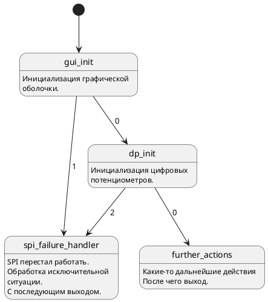

Plantuml to fsm tree generator
=====================

Данный репозитолрий содержит исходный код программы, генерирующий описание бинарного дерева для [module_fsm](https://github.com/Vadimatorik/module_fsm) из PlanUML файла.

Пример работы
---------------------
Входной файл test.pu

Вид диаграммы состояний в PlantUML:

