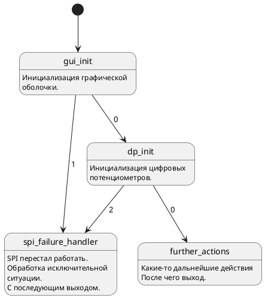

Plantuml to fsm tree generator
=====================

Данный репозитолрий содержит исходный код программы, генерирующий описание бинарного дерева для [module_fsm](https://github.com/Vadimatorik/module_fsm) из PlanUML файла.

Пример работы
---------------------
Входной файл test.pu


Вид диаграммы состояний в PlantUML:


Выходной файл text.cpp:

```cpp
#include "fsm.h"

extern const fsm_step< pc_vin_decoder > pc_vin_decoder_spi_failure_handler_fsm_step;
extern const fsm_step< pc_vin_decoder > pc_vin_decoder_gui_init_fsm_step;
extern const fsm_step< pc_vin_decoder > pc_vin_decoder_dp_init_fsm_step;
extern const fsm_step< pc_vin_decoder > pc_vin_decoder_further_actions_fsm_step;

const fsm_step< pc_vin_decoder > pc_vin_decoder_spi_failure_handler_fsm_step = {
	.func_step			= pc_vin_decoder::fsm_step_func_spi_failure_handler,
	.next_step_array		= nullptr,
	.number_array			= 0
};

const fsm_step< pc_vin_decoder >* pc_vin_decoder_gui_init_fsm_step_array[ 2 ] = {
	&pc_vin_decoder_dp_init_fsm_step,
	&pc_vin_decoder_spi_failure_handler_fsm_step
};

const fsm_step< pc_vin_decoder > pc_vin_decoder_gui_init_fsm_step = {
	.func_step			= pc_vin_decoder::fsm_step_func_gui_init,
	.next_step_array		= pc_vin_decoder_gui_init_fsm_step_array,
	.number_array			= 2
};

const fsm_step< pc_vin_decoder >* pc_vin_decoder_dp_init_fsm_step_array[ 2 ] = {
	&pc_vin_decoder_further_actions_fsm_step,
	nullptr,
	&pc_vin_decoder_spi_failure_handler_fsm_step
};

const fsm_step< pc_vin_decoder > pc_vin_decoder_dp_init_fsm_step = {
	.func_step			= pc_vin_decoder::fsm_step_func_dp_init,
	.next_step_array		= pc_vin_decoder_dp_init_fsm_step_array,
	.number_array			= 2
};

const fsm_step< pc_vin_decoder > pc_vin_decoder_further_actions_fsm_step = {
	.func_step			= pc_vin_decoder::fsm_step_func_further_actions,
	.next_step_array		= nullptr,
	.number_array			= 0
};
```
Правила использования
---------------------
* Точка входа в граф определяется по строке типа: <<[*] --> s1 >>
    Где:
    1. Строка начинается с последовательности символов <<[*]>>.
    2. Любой пробельный символ (пробел, tab). Возможно его отсутствие вовсе.
    3. Последовательность символов "-->".
    4. Любой пробельный символ (пробел, tab). Возможно его отсутствие вовсе.
    5. Имя последовательности (не путать с действительным именем вершины графа!).
* Каждая вершина графа должна быть определена по типу:
```cpp
state "name_func" as name_step {
name_step: Любые комментарии.
name_step: Но они могут отсутствовать.
}
```

Или

```cpp
state "name_func" as name_step {
}
```

    Где:
    1. name_func - имя вершины графа.
    2. name_step - имя шага. Именно по средством этого имени происходит связывание вершин.
* Предполагается, что сгенерированное дерево будет входить в состав класса. Методы, вызываемые в вершинах графа, будут являться static методами класса.
* Именя методов, являющимеся частью класса, в который входит fsm, генерируются автоматически по шаблону: строка <<fsm_step_func_>> + name_func.

Требования к программному обеспечению
---------------------
Для сборки проекта требуется наличие следующего программного обеспечения:
1. Библиотека QT5.10+.

Последовательность сборки:
```bash
git clone git@github.com:Vadimatorik/plantuml_to_fsm_tree_generator.git
cd plantuml_to_fsm_tree_generator/
mkdir build
cd build/
qmake -qt=qt5 ..
```
>>>>>>> a44623747f96845058370f055910d4d428ef552e
