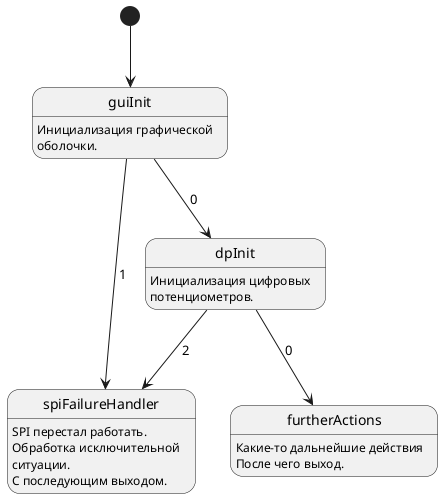

Plantuml to fsm tree generator
=====================

Данный репозитолрий содержит исходный код программы, генерирующий описание бинарного дерева для [module_fsm](https://github.com/Vadimatorik/module_fsm) из PlanUML файла.

Пример работы
---------------------
Входной файл test.pu
Выходной файл test.cpp


Вид диаграммы состояний в PlantUML:


Выходной файл text.cpp:

```cpp
#include "fsm.h"
#include "ayplayer.h"

extern const fsmStep< AyPlayer > ayPlayerSpiFailureHandlerFsmStep;
extern const fsmStep< AyPlayer > ayPlayerGuiInitFsmStep;
extern const fsmStep< AyPlayer > ayPlayerDpInitFsmStep;
extern const fsmStep< AyPlayer > ayPlayerFurtherActionsFsmStep;

const fsmStep< AyPlayer > ayPlayerSpiFailureHandlerFsmStep = {
	.funcStep				= AyPlayer::fsmStepFuncSpiFailureHandler,
	.nextStepArray			= nullptr,
	.numberArray			= 0
};

const fsmStep< AyPlayer >* ayPlayerGuiInitFsmStepArray[ 2 ] = {
	&ayPlayerDpInitFsmStep,
	&ayPlayerSpiFailureHandlerFsmStep
};

const fsmStep< AyPlayer > ayPlayerGuiInitFsmStep = {
	.funcStep				= AyPlayer::fsmStepFuncGuiInit,
	.nextStepArray			= ayPlayerGuiInitFsmStepArray,
	.numberArray			= 2
};

const fsmStep< AyPlayer >* ayPlayerDpInitFsmStepArray[ 3 ] = {
	&ayPlayerFurtherActionsFsmStep,
	nullptr,
	&ayPlayerSpiFailureHandlerFsmStep
};

const fsmStep< AyPlayer > ayPlayerDpInitFsmStep = {
	.funcStep				= AyPlayer::fsmStepFuncDpInit,
	.nextStepArray			= ayPlayerDpInitFsmStepArray,
	.numberArray			= 3
};

const fsmStep< AyPlayer > ayPlayerFurtherActionsFsmStep = {
	.funcStep				= AyPlayer::fsmStepFuncFurtherActions,
	.nextStepArray			= nullptr,
	.numberArray			= 0
};
```
Правила использования
---------------------
* Точка входа в граф определяется по строке типа: <<[*] --> s1>>
    Где:
    1. Строка начинается с последовательности символов <<[*]>>.
    2. Любой пробельный символ (пробел, tab). Возможно его отсутствие вовсе.
    3. Последовательность символов "-->".
    4. Любой пробельный символ (пробел, tab). Возможно его отсутствие вовсе.
    5. Имя последовательности (не путать с действительным именем вершины графа!).
* Каждая вершина графа должна быть определена по типу:
```cpp
state "nameFunc" as nameStep {
nameStep: Любые комментарии.
nameStep: Но они могут отсутствовать.
}
```

Или

```cpp
state "nameStep" as nameStep {
}
```

    Где:
    1. nameStep - имя вершины графа.
    2. nameStep - имя шага. Именно по средством этого имени происходит связывание вершин.
* Предполагается, что сгенерированное дерево будет входить в состав класса. Методы, вызываемые в вершинах графа, будут являться static методами класса.
* Имена методов, являющимеся частью класса, в который входит fsm, генерируются автоматически по шаблону: строка <<fsmStepFunc>> + NameFunc.

Требования к программному обеспечению
---------------------
Для сборки проекта требуется наличие следующего программного обеспечения:
1. Библиотека QT5.10+.

Последовательность сборки
---------------------
```bash
git clone git@github.com:Vadimatorik/plantuml_to_fsm_tree_generator.git
cd plantuml_to_fsm_tree_generator/
mkdir build && cd build/
qmake ..
make
cd ..
```

Сборка тестового файла.
```bash
./build/plantuml_to_fsm_tree_generator test/test.pu test/fsm_tree_board.cpp
```

Описание параметров:
1. Путь до входного файла.
2. Путь до выходного файла.

Параметры генерации
---------------------
В заголовке файла должны быть определены следующие константы:

CLASS_NAME
Имя класса, к которому будет относиться FSM дерево.
Пример:
CLASS_NAME						=		AyPlayer

FILE_WITH_CLASS_DESCRIPTION
Путь до файла с описанием класса, к которому будет относиться FSM дерево.
Пример: 
FILE_WITH_CLASS_DESCRIPTION		=		ayplayer.h